# FindIt — Lost & Found App

A lost-and-found platform for campuses. Users post lost or found items with photos; the server automatically matches them using perceptual image hashing.

## Demo

## Architecture
 

## Tech Stack

